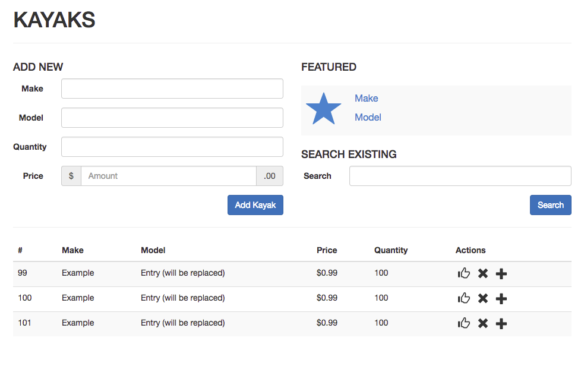

# Chi Git Practice
## Setup
1. Pick an unassigned issue from the [list](https://github.com/christopher-black/chi-git-practice/issues)
1. Request access to the repo
2. Clone the repo to your computer using `git clone https://github.com/christopher-black/chi-git-practice.git`
3. `cd` into the repo folder
4. Switch to the `develop` branch with `git checkout develop`
5. Create a branch for your feature `git branch feature-YOUR-FEATURE`
6. Switch to that branch `git checkout feature-YOUR-FEATURE`
7. Run `npm install`
8. Open Postico and run the following queries in your `chi` database:

  ```
  CREATE TABLE kayaks(
  	id SERIAL PRIMARY KEY,
  	make VARCHAR (100) NOT NULL,
  	model VARCHAR (100) NOT NULL,
    likes INTEGER DEFAULT 0,
  	price NUMERIC(12,2),
  	quantity INTEGER
  );

  INSERT INTO kayaks (make, model, price, quantity)
  VALUES ('Sun Dolphin', 'Aruba 10', 149.99, 10),
  ('Wilderness Systems', 'Aspire', 779.00, 8),
  ('Sun Dolphin', 'Aruba SS 12', 408.99, 12),
  ('Old Town', 'Vapor 10', 399.99, 6);
  ```
9. Complete your task
10. Follow the [instructions](https://github.com/christopher-black/chi-git-examples) for merging your task into `develop`

## Instructions
Pick a task from the list. Look for the code comment associated to your task. Add code between the comment blocks. **Keep all code between the comment blocks to avoid conflicts.** All of these tasks should be 20 lines of code or less to complete.

## Task List
**Setup**
- [x] Set up Node
- [x] Database queries
- [x] index.html with basic template
- [x] Add tasks

**Server Tasks**
_routes/kayak.js_

- [ ] 1. Add a GET route  `'/'` to return all Kayaks
- [ ] 2. Add a POST route `'/add'` to add a Kayak
- [ ] 3. Add a PUT route `'/like/:id'` to increase like count for a Kayak by one
- [ ] 4. Add a GET route `'/search/:term'` to search for a Kayak by make or model
- [ ] 5. Add a DELETE route `'/delete/:id'` to delete a Kayak
- [ ] 6. Add a PUT route `'/buy/:id'` that decreases the quantity of a Kayak by one
- [ ] 7. Add a PUT route `'/restock/:id'` that increases the quantity of a Kayak by one


**Client Tasks**
_client.js_

> Don't forget to to call `refreshKayaks()` on success

- [ ] 8. Function to `appendKayaksToDom(kayaks)`
- [ ] 9. AJAX call to get Kayaks in the `refreshKayaks()` function
- [ ] 10. Function to `appendFeaturedKayakToDom(kayak)`
- [ ] 11. AJAX call to like a Kayak - use url param
- [ ] 12. AJAX call to search Kayaks - use url param
- [ ] 13. AJAX call to add a new Kayak
  - Use data, e.g. `data: {make: 'make', model: 'model', price: '99.99', quantity: 10}`
- [ ] 14. AJAX call to delete a Kayak - use url param
- [ ] 15. AJAX call to buy a Kayak - use url param
- [ ] 16. AJAX call to restock a Kayak - use url param
- [ ] 17. Function to `validateForm()`

_style.css_

- [ ] 18. Make improvements to the styles, keep it simple and avoid changing the HTML

## Screenshot

